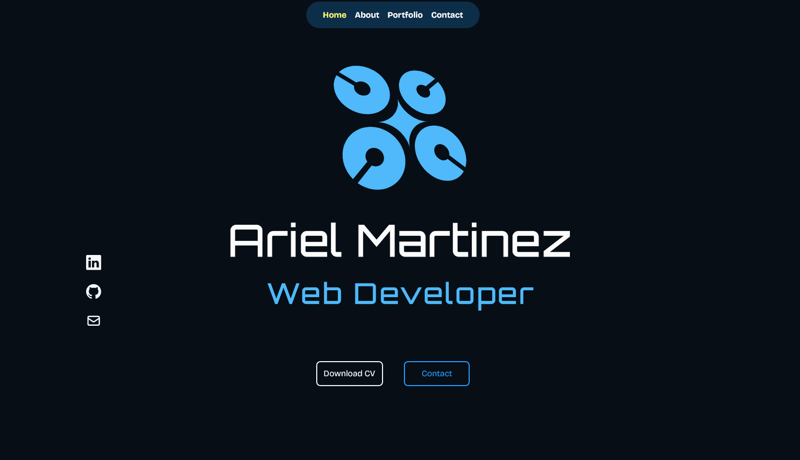

# My Porfolio

This is my project created with Vite. Here you will find information about the project, how to set it up, and how to run it.

## Technologies Used

- Vite
- React
- CSS

## Installation

1. Clone this repository to your local machine.
2. Open a terminal and navigate to the project folder.
3. Run the following command to install the dependencies:

`` yarn or npm i ``

## Usage

1. Run the following command to start the application:

`` yarn dev or npm run dev ``

2. Open your browser and visit `http://127.0.0.1:5173/`

## Contact

If you have any questions or suggestions, feel free to contact me. You can find me on [my website](https://portfolio-react23.vercel.app/) or email me at [arielstereo@msn.com](mailto:arielstereo@msn.com).

Thanks for visiting my project!

